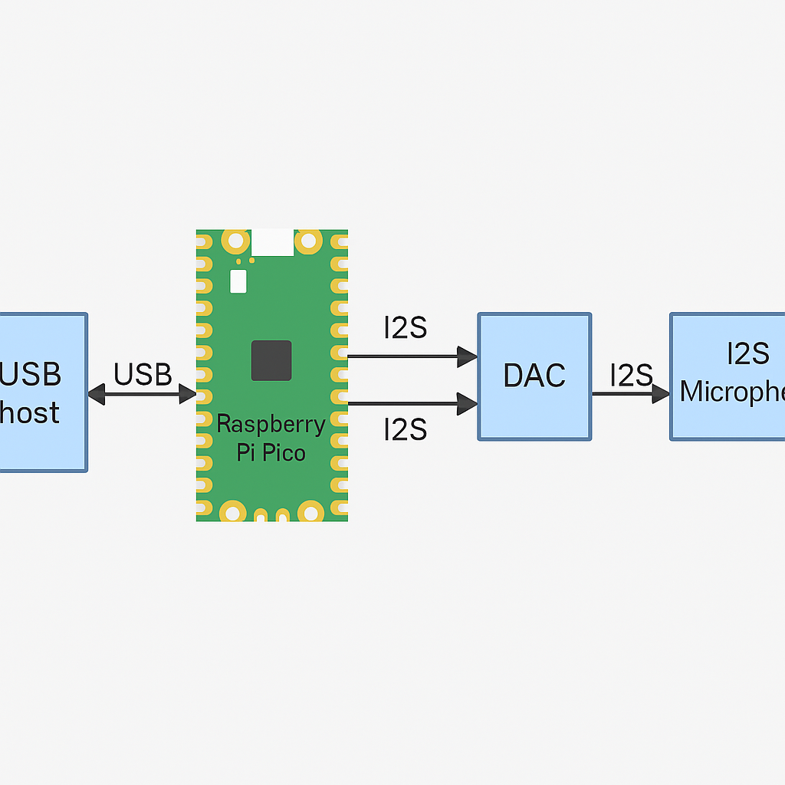

# pico-sound-inout
라즈베리 파이 피코로 구현하는 USB 마이크와 사운드 카드 장치

## 하드웨어
+ Raspberry Pi RP2040-Zero Mini
+ MEMS Microphone Module -I2S, INMP441
+ CJMCU-1334 DAC Module CJMCU-1334

## 핀 연결
+ I2S BCK (Bit Clock)	GPIO10
+ I2S LRCK (Left/Right Clock)	GPIO11
+ I2S DIN (INMP441 마이크 데이터)	GPIO12
+ I2S DOUT (CJMCU-1334 DAC 데이터)	GPIO9

## 소프트웨어
### 라이브러리
### 코드
+ pico-soundcard.ino
